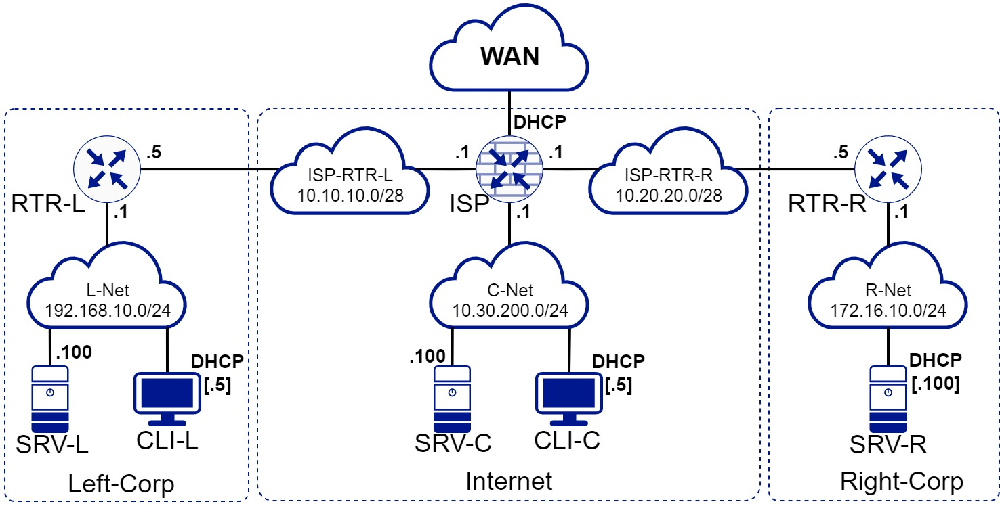

### Конкурсное задание. ЮниорПрофи 2022-23. Отбор

#### Компетенция "Сетевое и системное администрирование 14-16"

Количество часов на выполнение задания: **4** часов

Версия **1.4** от **10.10.2022**

#### ОПИСАНИЕ КОНКУРСНОГО ЗАДАНИЯ

#### СХЕМА ОЦЕНКИ

Оцениваемые аспекты имеют разный вес в зависимости от их сложности. Схема оценки построена так, чтобы каждый аспект оценивался только один раз. Например, в задании предписывается настроить корректные имена для всех устройств, данный аспект будет оценен только один раз и повторная оценка данного аспекта проводится не будет.
Следует также учесть, что для данного задания возможна **автоматическая** оценка результатов.

#### НЕОБХОДИМОЕ ОБОРУДОВАНИЕ, ПРИБОРЫ, ПО И МАТЕРИАЛЫ

Конкурсное задание выполнимо в полном объеме с привлечением оборудования и материалов, указанных в *Инфраструктурном листе*.
Для выполнения задания возможно использование виртуальной инфраструктуры.

Используемое ПО:
RTR-L используют OPNsense 22.7;
ISP, SRV-L  используют Debian 11.05;
CLI-L использует Ред ОС 7.3.1 с графическим окружением Mate;
RTR-R, SRV-R использует Ред ОС 7.3.1
CLI-C использует Windows 10 Education/Enterprise;
SRV-C использует Windows Server 2022.

#### ИНСТРУКЦИИ ДЛЯ УЧАСТНИКОВ

В первую очередь рекомендуется прочитать задание полностью. Следует обратить внимание, что задание составлено не в строгом хронологическом порядке. Для выполнения некоторых пунктов задания может потребоваться выполнение действий из других пунктов, которые изложены в задании ниже. Таким образом, **порядок выполнения задания и распределение временных затрат определяется участниками самостоятельно.**

Участникам разрешено пользоваться Интернетом. Находить и использовать информацию можно исключительно из **открытых источников**. Скачивать, использовать заготовленный перед конкурсом материал, файлы, скрипты, сайты для конкурса **запрещено**.

Рекомендуется тщательно проверять результаты своей работы. Также учтите, что в конце дня Вам необходимо по указанию экспертов **выключить все виртуальные машины**, а затем включить их в желаемом порядке.

Устройства участников могут иметь **предустановленное программное обеспечение**, которое будет применяться при проверке и оценке, его не рекомендуется удалять. Если данное ПО будет преустановленно, то участникам и экспертам будет сообщено о нём перед началом конкурса. 

Если реализация предполагает использование виртуальных машин, то рекомендуется включать только те машины, которые необходимы для выполнения задания. **Тщательно распределяйте имеющиеся ресурсы.**

Доступ к ISP, SRV-L, SRV-R, RTR-R, SRV-R, CLI-L осуществляется через '**root**' с паролем '**toor**'.
Доступ к RTR-L осуществляется через '**root**' с паролем '**opnsense**'.
Доступ к SRV-C, CLI-C должен быть организован участниками через пользователя по заданию с паролем '**P@ssw0rd**'.

### ЗАДАНИЕ

#### НАСТРОЙКИ ПРОВАЙДЕРА

Для связи с Интернетом получите настройки сетевого контроллера через DHCP.

#### НАСТРОЙКИ IP-АДРЕСАЦИИ

##### Таблица 1. Настройка IP-адресации

| Устройство | Сеть      | Адрес IPv4/Маска      |
| ---------- | --------- | --------------------- |
| ISP        | WAN       | DHCP                  |
|            | ISP-RTR-L | 10.10.10.1/28         |
|            | ISP-RTR-R | 10.20.20.1/28         |
|            | C-Net     | 10.30.200.1/24        |
| RTR-L      | ISP-RTR-L | 10.10.10.5/28         |
|            | L-Net     | 192.168.10.1/24       |
| RTR-R      | ISP-RTR-R | 10.20.20.5/28         |
|            | R-Net     | 172.16.10.1/24        |
| SRV-L      | L-Net     | DHCP [192.168.10.100] |
| CLI-L      | L-Net     | DHCP                  |
| SRV-R      | R-Net     | 172.16.10.100/24      |
| CLI-C      | C-Net     | DHCP                  |
| SRV-C      | C-Net     | 10.30.200.100/24      |

##### Базовая настройка

1. Настройте имена всех устройств и виртуальных машин в соответствии с **Топологией сети.**

2. Настройте IPv4-адресацию на всех сетевых интерфейсах в соответствии с **Настройками IP-адресации**.

3. На всех устройствах должно быть установлено актуальное время и часовой поясу (GMT+3) | (UTC+3). *Рекомендуется использовать часовой пояс Москвы.*

##### Сетевая связанность

1. Обеспечьте выход в Интернет всех устройств в **Топологии сети.**
   1. Используйте трансляцию сетевых адресов на RTR-L, RTR-R, ISP.
2. Настройте DHCP-сервер на SRV-C для сети C-Net.
   1. Используйте пул адресов **10.30.200.10 - 10.30.200.20**.
   2. Адрес **10.30.200.15** должен быть исключён из автоматической выдачи адресов.
   3. Полученный IP-адрес CLI должен быть зарезервирован.
   4. В качестве адреса DNS-сервера используется адреса по порядку: SRV-C, ISP.
3. Настройте DHCP-сервер на RTR-L для сети L-Net.
     1. Используйте пул адресов **192.168.10.10 - 192.168.10.100**.
     2. Адрес **192.168.10.50** должен быть исключён из автоматической выдачи адресов.
     3. IP-адрес **192.168.10.100** должен быть зарезервирован для SRV-L.
     4. В качестве адреса DNS-сервера используется адрес ISP.
     5. В качестве доменного имени используется '**JuniorProfi.local**'.

4. На устройствах RTR-R, RTR-L должен быть настроен межсетевой экран.
   1. Разрешение портов должно быть выполнено по принципу **"необходимо и достаточно"**.
       *Должно быть разрешено только то, что указано в задании - остальное заблокировано.*
   2. Запретите попадание не транслируемого сетевого трафика с внешних сетей во внутренние сети Left-Corp и Right-Corp.
   3. Разрешено подключение внешних клиентов к HTTP/HTTPS, SSH службам внутренних устройств.
   4. Разрешен приём протоколов ICMP, SSH к RTR-L, RTR-R.
   5. Устройства внутри локальных сетей Right-Corp, Left-Corp **не должны** иметь ограничений по выходу во внешние сети.
   6. Любые подключение внутри туннеля должны быть разрешены.
5. Обеспечьте настройку подключений к службе SSH на SRV-R, SRV-L.

     1. Подключения со стороны внешних клиентов на порт **2222** к RTR-R должны быть перенаправлены на SRV-R.
     2. Подключения со стороны внешних клиентов на порт **2244** к RTR-L должны быть перенаправлены на SRV-L.
6. Обеспечьте настройку подключений к веб-сервисам на SRV-R, SRV-L.

   1. Подключения со стороны внешних клиентов на порт **80** к RTR-R должны быть перенаправлены на SRV-R.
   2. Подключения со стороны внешних клиентов на порт **80**, **443** к RTR-L должны быть перенаправлены на SRV-L.
7. Между локальными сетями Left-Corp, Right-Corp должен быть установлен защищенный туннель, **wireguard**, позволяющий взаимодействовать SRV-R, SRV-L между собой используя локальные адреса.
     1. Содержимое пакетов, проходящее по данному туннелю, должно быть зашифровано.

##### Инфраструктурные службы

1. Настройте AD DS на SRV-C.
   1. SRV-C должен быть контроллером домена '**JuniorProfi.win.local**'.
   2. Создайте подразделение '**DomainOU**'в домене. Добавьте в подразделение компьютер DomainPC.
   3. Создайте двух пользователей '**User1**' и '**User2**' для в подразделении '**DomainOU**'.

2. Настройте CLI.
   1. Введите CLI в домен '**JuniorProfi.win.local**'.
   2. Добавьте CLI в подразделение '**DomainOU**'.
   3. Включите встроенного администратора и удалите все другие локальных учётные записи с CLI, когда устройство будет в домене.
   4. Разрешите приём эхо-запросов с других устройств сети. Брандмауэр должен быть включён.

3. Установите и настройте роль IIS на SRV-C.
   1. Создайте тестовый сайт для компании. На стартовой странице должен быть текст «Welcome to JuniorProfi.local!».
   2. Сайт должен быть доступен по домену '**ws.JuniorProfi.win.local**' по https для CLI.
   3. Сайт должен быть доступен по домену '**ws.JuniorProfi.local**' по https для всех остальных.
   4. При обращение к сайту по протоколу http должна происходить автоматическая переадресация на протокол https.

4. Настройте GPO на контроллере домена SRV-C.
   1. Запретите анимацию при первом входе пользователей в систему на всех клиентских компьютерах домена.

   2. Удалите иконку корзины для пользователей в подразделении '**DomainOU**'.

5. Выполните настройку DNS-сервера **bind9** на ISP.
   1. Сервер должен обслуживать зону "JuniorProfi.local".
   2. База данных зоны должна храниться в директории `/var/bind9-zones`.
   3. Настройте разрешение имен в соответствии с таблице, **добавив** в новую зону следующие записи:

| Тип записи | Ключ     | Значение      |
| ---------- | -------- | ------------- |
| A          | isp      | 10.30.200.1   |
| A          | rtr-l    | 10.10.10.0    |
| A          | rtr-r    | 10.20.20.0    |
| A          | srv-c    | 10.30.200.100 |
| CNAME      | ws       | srv-c         |
| CNAME      | www      | rtr-l         |
| CNAME      | www      | rtr-r         |
| CNAME      | internet | isp           |

6. Настройте **apache2** на SRV-L.
   1. Используя **git**, клонируйте репозиторий "[Будет предоставлен позже]" в директорию `/var/www`.
   2. Сервер должен открывать файл *index.html* клонированного репозитория по умолчанию.
   3. При обращение к сайту по протоколу http должна происходить автоматическая переадресация на протокол https.

7. Настройте **nginx** на SRV-R.
   1. Используя **git**, клонируйте репозиторий "[Будет предоставлен позже]".
   2. Сервер должен открывать файл *index.html* клонированного репозитория по умолчанию.

8. Настройте **openssh-server** на SRV-R, SRV-L.
   1. Создайте пользователей '**ssh-user**' с паролем '**P@ssw0rd**' для подключения по ssh.
   2. Созданные пользователи должны иметь возможность повышать свои права до суперпользователя, используя **sudo**.
   3. По ssh имеет право подключиться только пользователь '**ssh-user**'.

#### ТОПОЛОГИЯ

